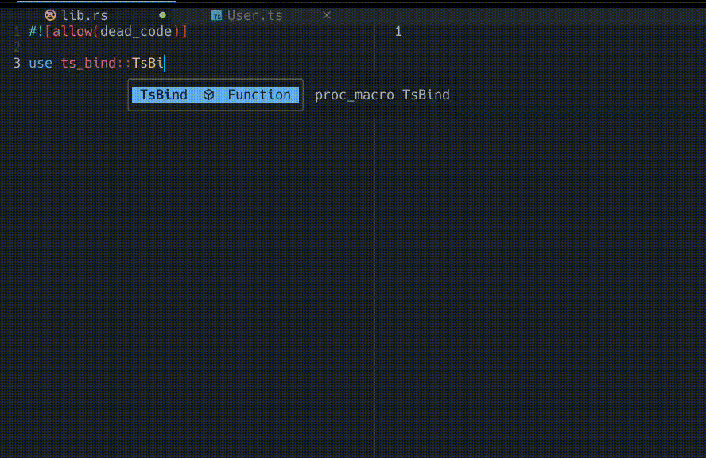

# TsBind

A Rust crate for generating TypeScript bindings from structs.

## Installation

```bash
cargo add ts-bind
```

## Usage

Add the following to your Rust code:

```rust
use ts_bind::TsBind;

#[derive(TsBind)]
struct MyStruct {
    field1: String,
    field2: i32,
}
```

This will generate the corresponding TypeScript interface in the `bindings` directory.

```tsx
// bindings/MyStruct.ts
export interface MyStruct {
  field1: string;
  field2: number;
}
```

## Features

### Auto import

Unknown types will automatically be imported to the output TypeScript file.

```rust
#[derive(TsBind)]
struct User {
    id: i32,
    posts: Vec<Post>,
}

#[derive(TsBind)]
struct Post {
    title: String,
}
```

```tsx
// bindings/User.ts
import { Post } from "./Post";

export interface User {
  id: number;
  posts: Post[];
}

// bindings/Post.ts
export interface Post {
  title: string;
}
```

### Skipping fields

You can skip fields by adding the `#[ts_bind(skip)]` attribute.

```rust
#[derive(TsBind)]
struct User {
    id: i32,
    #[ts_bind(skip)]
    password: String,
}
```

```tsx
export interface User {
  id: number;
}
```

## Attributes

The `ts_bind` attribute supports the following optional arguments:

| Argument | Description                     |
| -------- | ------------------------------- |
| `rename` | Rename the generated interface. |

```rust
#[derive(TsBind)]
struct User {
    id: i32,
    #[ts_bind(rename = "postCount")]
    post_count: i32,
}
```

```tsx
export interface User {
  id: number;
  postCount: number;
}
```

## Todo

The library is far from complete. Here are some of the features that are planned:

- [ ] Support for enums.
- [ ] `#[ts_bind(export = "path/to/export")]` custom export path.
- [ ] `#[ts_bind(rename_all = "camelCase")]` attribute to rename all fields.
- [ ] `#[ts_bind(skip)]` attribute to skip fields.
- [ ] `#[ts_bind(skip_if = "condition")]` attribute to skip fields based on a condition.

## Contributing

Feel free to open issues or submit pull requests on our [GitHub repository](https://github.com/dcodesdev/ts-bind).

## License

This project is licensed under the MIT License. See the [LICENSE](LICENSE) file for details.
